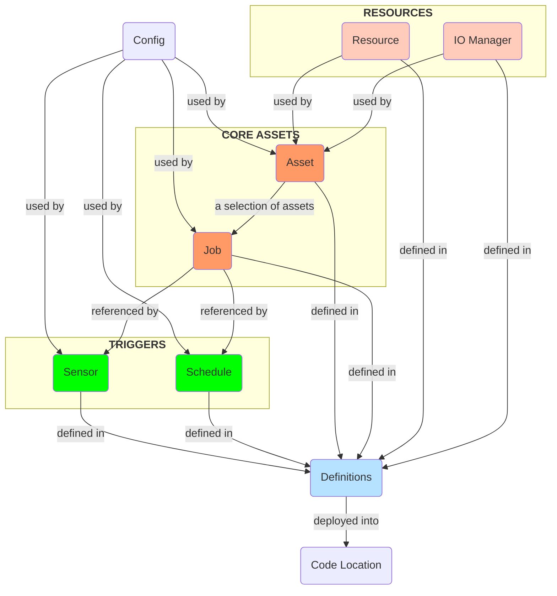

# tutorial.dagster
Tutorial on how to use dagster to build a data pipeline

## Main Concepts

- **Asset**: a logical unit of data such as a table, dataset, or machine learning model.
- **Job**: a subset of **assets**.
- **Config**: a set schema applied to a Dagster object that is input at the time of execution.
- **Resource**: a configurable external dependency, used to manage connections to external systems.
- **IO Manager**: defines how data is stored and retrieved between the execution of **assets** and **ops**.
- **Schedule**: a way to automate **assets** or **jobs** to occur on a specified interval.
- **Sensor**: a way to trigger **assets** or **jobs** when an event occurs.
- **Definitions**: a top-level construct that contains references to all the objects of a Dagster project, including
  - assets
  - jobs
  - resource
  - io manager
  - schedule
  - sensor
- **Code Location**: a collection of **Definitions** deployed in a specific environment.

The relation maps of Dagster concepts:

